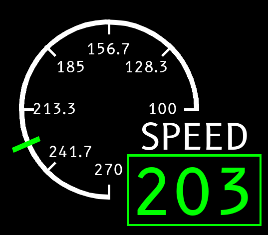

Test ECAM style gauge with Pygame
============================

Not so elegant Pygame code to simulate an ECAM (Electronic Centralised Aircraft Monitoring) style gauge in Pygame. 
It is tested on Raspberry Pi 4 with a custom Buildroot image. It uses the B612 family of fonts designed by Airbus to 
improve the display of information on the cockpit screens.

